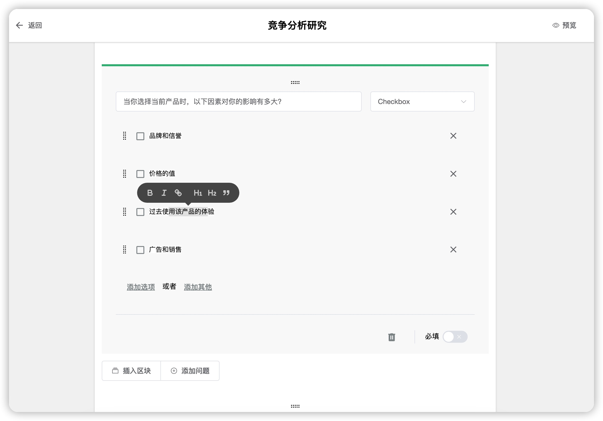
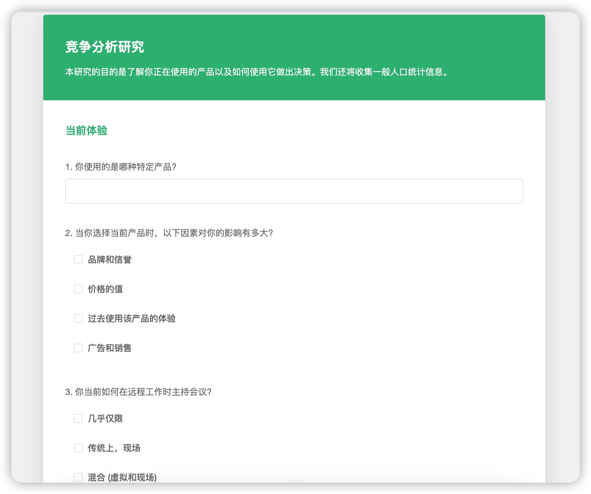

# 

 

## Hibox 是一个基于 Vue、Nuxtjs、Pinia 和 TypeScript 构建的表单系统，旨在模仿 Google Form，并提供方便定制化开发的解决方案。

### 它允许用户创建、共享、收集和分析调查问卷和表格，提供丰富的定制选项，适应多种项目的需求。

  
  

 
 

#### 主要特点和优势：

* 模仿 Google Form设计： Hibox 设计灵感源自 Google Form，提供直观、易用的界面和功能，使用户能够快速上手并创建自定义表单。

* 基于 Vue 和 Nuxtjs： 利用 Vue 和 Nuxtjs 的强大功能和生态系统，构建响应式、高性能、SEO友好的单页面应用，实现无缝的用户体验。

* 使用 Pinia 进行状态管理： 整合 Pinia 管理表单系统的状态，实现可预测、可维护的状态管理，确保表单数据的一致性和可靠性。

* 采用 TypeScript 编写代码： 使用 TypeScript 提高代码可读性和可维护性，以及更好的类型检查，减少潜在的错误。

* 定制化开发： 提供丰富的定制选项，允许开发人员根据项目需求定制表单结构、样式、验证规则等，以满足不同用户的特定需求。

* 数据实时同步和分析： 支持实时数据收集，将用户的回答同步到服务器，并提供数据分析功能，包括图表、统计数据等，以便用户深入了解数据。

* 响应式设计： 设计具有响应式特性，确保在各种屏幕尺寸和设备上提供良好的用户体验，包括移动设备和桌面端。

#### Hibox 是为开发人员提供灵活、可定制的表单解决方案，以满足不同项目和用户的特定需求。

